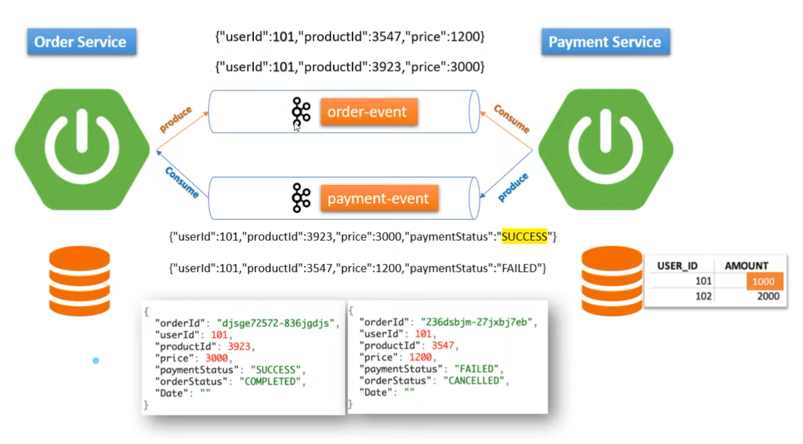

## SAGA Choreography Design Pattern

[microservices.io](https://microservices.io/patterns/data/saga.html)

You have applied the Database per Service pattern. Each service has its own database. Some business transactions, 
however, span multiple service so you need a mechanism to implement transactions that span services. 
For example, let’s imagine that you are building an e-commerce store where customers have a credit limit. 
The application must ensure that a new order will not exceed the customer’s credit limit. 
Since Orders and Customers are in different databases owned by different services the application cannot 
simply use a local ACID transaction.

Example Scenario:
